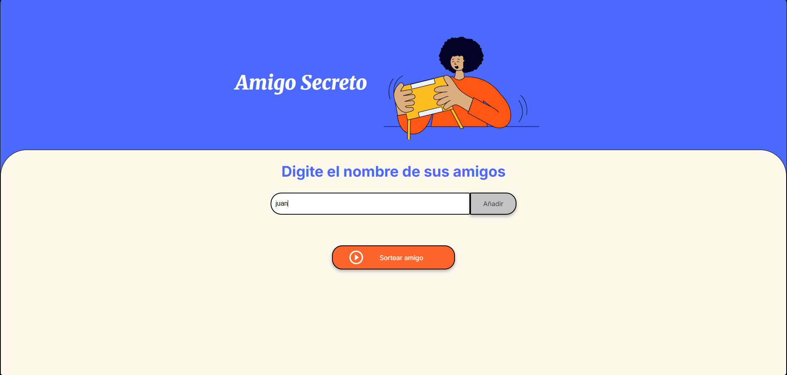
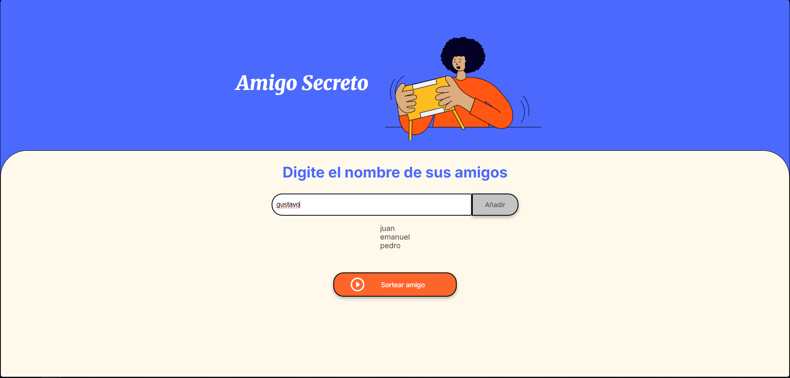
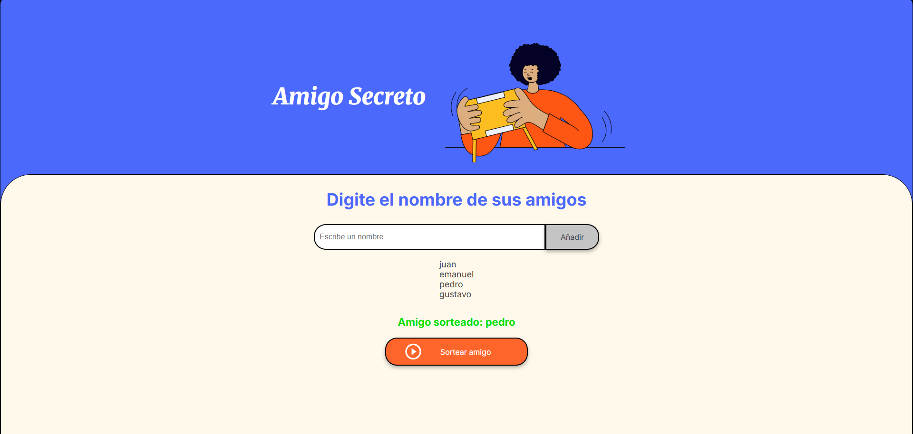

# challenge_amigo_secreto


Este proyecto es una aplicación web sencilla desarrollada en HTML, CSS y JavaScript para simular el popular juego de "Amigo Secreto". Permite agregar nombres a una lista y luego seleccionar aleatoriamente uno de ellos mediante un sorteo.

---

## 📌 Funcionalidades

- ✅ Agregar nombres a una lista dinámica.
- ✅ Validar que el campo no esté vacío antes de agregar un nombre.
- ✅ Visualizar la lista de amigos ingresados.
- ✅ Sortear un nombre aleatorio de la lista.
- ✅ Mostrar el resultado del sorteo en pantalla.

---

## Capturas de pantalla

### Agregando nombres

### Mostrar Lista de Nombres

### Sorteando un amigo secreto



## 🚀 Cómo usar

1. Clona el repositorio:
```bash
git clone https://github.com/Shinra3245/amigo-secreto.git
```

2.  Abre el archivo index.html en tu navegador web.

3. Escribe nombres en el campo de entrada y haz clic en “Añadir”.

4. Haz clic en “Sortear amigo” para elegir un nombre al azar.

🧠 Aprendizajes aplicados
- Manipulación del DOM con JavaScript.
- Uso de arrays y ciclos `for`.
- Generación de números aleatorios con `Math.random()` y `Math.floor()`.
- Validación de formularios.
- Uso básico de `innerHTML` y `appendChild`.

🛠️ Tecnologías utilizadas
 — estructura base de Alura Latam.
 — estilos base de Alura Latam.
 — lógica de validación, sorteo y DOM dinámico.

---
## 📄Licencia
Este proyecto se encuentra bajo una licencia abierta. Puedes modificarlo y reutilizarlo con fines educativos o personales.

🔗 Probar la app en vivo(https://shinra3245.github.io/challenge_amigo_secreto)


## 💡 Autor

Desarrollado como parte del programa Oracle ONE + Alura Latam por Omar Bolaños García
El diseño de interfaz basado en las guías visuales de Alura.

¡Gracias por visitar este proyecto!

